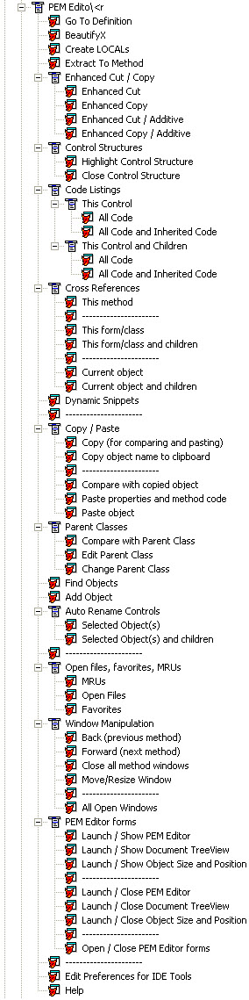

# PEM Editor

PEM Editor provides replacement for the native dialogs to add, edit, and maintain properties, events, and methods.

## Release History

### Version 7.41.18, released 2024-04-08

- Refactored PEMEditor_Utils.FocusOnControl  to avoid re-setting form properties except in the case where the form has an empty caption, avoiding the "Save Changes" dialog when no changes were conciously made.

### Version 7.41.15, released 2024-03-31

- Made PEMEditor_Utils.SetCurrentSelectedObject accept tlWindowAlreadyActive parameter and pass it to FocusOnControl, which does not activate window if .T.

### Version 7.41.14, released 2024-03-10

- Added support for using Project Explorer to edit a file if it's available.

### Version 7.41.13, released 2023-10-25

- Corrected minor bugs related to BeautifyX and CREATE LOCALS

### Version 7.41.12, released 2023-07-01

- Fixed problem where installing PEMEditor using CFU did not register all the other (about 40) tools that PEMEditor delivers.

### Version 7.41.11, released 2023-06-11

- BeautifyX, for SELECT Group By and Order By into new lines issue #40 a problem occurs with white space between comma and number, fixed #40

### Version 7.41.10, released 2023-06-07

- BeautifyX
  * For BeautifyX / Select statements, do not always separate Group By and Order By into new lines, fixed #40
- Create Locals
  * BeautyfyX calling locals code takes out comment block; fixed [Thor issue on \#106](https://github.com/VFPX/Thor/issues/106)
  * Have Locals code add locals below header block and below lParameter statements; fixed [Thor issue \#104](https://github.com/VFPX/Thor/issues/104)
  * Closing [Thor issue \#107](https://github.com/VFPX/Thor/issues/107)
- Automatic version and release date substitution in Readme.md for VFPX Deployment.

### Version 7.41.09, released 2023-03-11

* Fixed a bug that causes an error in [IntelliSenseX](https://github.com/VFPX/IntelliSenseX) when used with an empty object ([issue 37](https://github.com/VFPX/PEMEditor/issues/37)).

### Version 7.41.08, released 2023-02-16

* Fixed some minor bugs that allow it to work better with [IntelliSenseX](https://github.com/VFPX/IntelliSenseX).

* Implemented [VFPX Deployment](https://github.com/VFPX/VFPXDeployment), removed unused files, and cleaned up folder structure (ThorUpdater was moved from Downloads to the project root).

### Version 7.41.07, released 2023-02-06

* Removed GoToDefinition V1 from PEMEditor (actually, just the creation of the Thor tool) since V2 is now a separate [VFPX project](https://github.com/VFPX/GoToDefinition).

### Version 7.41.05, released 2022-10-30

* PEM Editor now supports member names up to 128 characters (previously, it cut off names at 60 characters).
* It now supports creating bookmarks when using GoToDefinition.

### Version 7.41.04, released 2022-06-11

* Fixed a bug in Create Locals that caused an error when code block with TEXT or #IF was not closed with ENDTEXT / #ENDIF

### Version 7.41.02, released 2022-05-29

* Fixed a bug in BeautifyX that caused an error beautifying a SQL SELECT statement under some conditions.

### Version 7.41.01, released 2022-04-07
#### Create Locals
- Fixed issue #24 _IntellisenseX with Dot / LOCALs etc_

### Version 7.41.00
#### Create Locals
- Fixed issue #9 _BeautifyX doesn't catch all arrays_
- New option to define arrays as LOCAL ARRAY
- New option to define arrays with round brackets
#### BeautifyX
- New option to allow formating of SQL statements that are written in a single line.

### Version 7.40.03
Debug code removed

### Version 7.40.02
Different place to compile PEMEditor.APP, to get relative paths.

### Version 7.40.01
recompiled in VFP9SP2

### Version 7.40.00: What's new in this release

* **[Click here for change list](Documentation/pemeditor_thor_changes_7_40.md)**

### Version 7.30.02: Bug fixes

Version 7.30.02 *really* fixes a bug in handling containers with controls that fully overlap the container.

### Version 7.30: Bug fixes

Version 7.30 fixes a bug in handling containers with controls that fully overlap the container and fixes the support for Thor Check for Updates.

### Version 7.20: IntellisenseX

IntellisenseX provides downdown lists of properties or field names when setting the ControlSource property.

See [Setting ControlSources in PEM Editor](https://github.com/VFPX/IntelliSenseX/blob/master/documents/Thor_IntellisenseX_ControlSources.md).

### Version 7.11: What's new in this release

There are no visible changes to in this release. A large number of bugs have been corrected, most notably the problem with selecting an object from the combobox in PEM Editor or from Document TreeView for obscured or hidden objects, objects on not-visible pages in a pageframe, and containers.

### Version 7.1, released 2011-10-23

There are no visible changes to PEM Editor w/IDE Tools in this release. However, there have been a number of internal changes to the objects in PEM Editor which support the tools in the Thor Repository.

### Version 7: What's new in this release

As noted, this release contains a long list of new IDE Tools. They are listed below (the display is created by Thor).  

There are separate files in the Documentation folder for each of these tools. This documentation is also accessible from within the Thor User Interface.  

Version 7 Production - Released 2011-09-03 (356 downloads)  

Version 7 Beta 5 - Released 2011-08-22 (93 downloads)  

Version 7 Beta 4 - Released 2011-08-09 (103 downloads)  

Version 7 Beta 3 - Released 2011-07-22 (127 downloads)  

Version 7 Beta 2 - Released 2011-06-19 (242 downloads)  

Version 7 Beta - Released 2011-06-03 (175 downloads)  

### Prior versions

Version 6.10 - Released 2010-11-14  

Version 6 - Released 2010-09-0 (457 downloads)  

Verion 6 Beta 1 - Released 2010-05-02 (533 downloads)  

Version 5.07 - Release 2009-12-02 (1,437 downloads)  

Version 5 - Release 2009-10-11 (702 downloads)  

Version 4.10 - Released 2009-08-16 (653 downloads)  

Version 4 - Released 2009-07-05 (671 dowbloads)  

Version 3.01 - update released 2009-02-22  

Version 3.0 - Released 2009-01-11 (1,252 downloads) By Jim Nelson, with help from Doug Hennig, Matt Slay, and Rick Schummer.  

Version 2.0 - Released 2008-11-10 By Jim Nelson and Doug Hennig.  

Version 1.0 by Marcia Akins

----
Last changed: _2023/06/11_ 