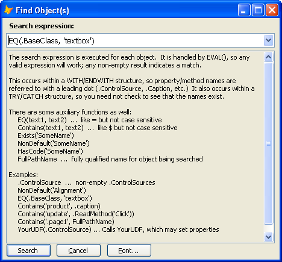

## PEM Editor Version 6.10 Beta 2

_(Released 2010-10-22)_

Project Manager  [Jim Nelson](http://www.codeplex.com/site/users/view/JimRNelson)

[release:Click here to download](53745)

**Enhancements in this release**

This release has enhancements dealing with multiple objects: a new form for editing properties when multiple objects are selected, and a new search tool for selecting objects.

**Editing a property for multiple objects**

When you have selected multiple objects with your mouse, there is a new form for editing the properties for the selected objects.  Ctrl+Click on a row in the PEM Editor's grid to bring up the Results Form:

You can double click on the value of a property to edit that property, or double-click on the name of the object in the first column to navigate to that object.

You can also add, remove, resize, and re-order the columns.

**Searching for objects**

There is a new search tool for finding objects in your form/class that meet criteria that you specify. This allows you to specify (find) objects and then modify their properties, using the new form displayed above, and also to navigate between the objects.

Searching is initiated by using the new Binoculars Icon at the top of the PEM Editor form:

This brings up the new 'Find Object(s)' form, which allows you to enter your own search expression to find objects in your form or class. The result of your search is displayed in the new form (above) for editing properties for multiple objects. 

Objects which match the search criteria are displayed in the Results form (shown at the top of this release page).

