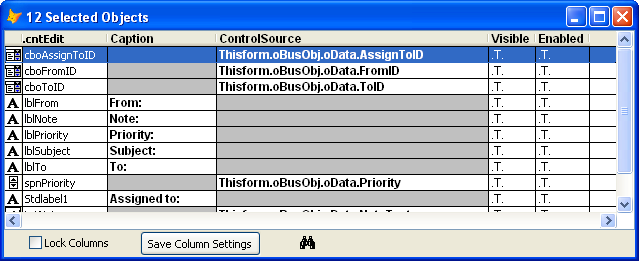

# PEM Editor Version 6.10
### Replacement for the native VFP dialogs to add, edit and maintain properties, events, and methods. 
_Supported in VFP8 and VFP9_
Released 2010-11-14

A complete replacement for:
* Edit Property/Method 
* New Property 
* New Method 
* Properties Window 
* Document View (for SCX and VCX only)
Beginning with Version 6, it also provides a wide range of IDE enhancements

**Videos - ** [Watch the PEM Editor Video Series](http://www.tinyurl.com/PEM-Editor-Videos)(Note: These videos were released with version 4, but are still helpful to get started with PEM Editor.) 

[release: Click here to download the latest release of PEM Editor 6.10](21230)

[release: Click here to download the documentation for PEM Editor 6.10](21230)

### Version 6.10: What's new in this release

This release has enhancements dealing with multiple objects: a new form for editing properties when multiple objects are selected, and a new search tool for selecting objects.

**Editing a property for multiple objects**

When you have selected multiple objects with your mouse, there is a new form for editing the properties for the selected objects.  Ctrl+Click on a row in the PEM Editor's grid to bring up the Results Form:

You can double click on the value of a property to edit that property, or double-click on the name of the object in the first column to navigate to that object.

You can also add, remove, resize, and re-order the columns.

**Searching for objects**

There is a new search tool for finding objects in your form/class that meet criteria that you specify. This allows you to specify (find) objects and then modify their properties, using the new form displayed above, and also to navigate between the objects.

Searching is initiated by using the new Binoculars Icon at the top of the PEM Editor form:

This brings up the new 'Find Object(s)' form, which allows you to enter your own search expression to find objects in your form or class. The result of your search is displayed in the new form (above) for editing properties for multiple objects. 

Objects which match the search criteria are displayed in the Results form (shown at the top of this release page).

### Version 6.00: What's new in this release

This release contains numerous major enhancements and minor enhancements.

**Major Enhancements (from 5.07 to 6) **
* **PEM Editor IDE Tools**, which are available when the focus is not on PEM Editor. They are accessible through a menu in the VFP main menu or the Tools menu, as well as by user definable hotkeys. 
* **Go To Definition** - to go directly to the definition of a method, object, or property based on a reference to it in code. 
* **Back** (previous method) and **Forward** (next method) - to cycle backward or forward through the list of open method code or PRG windows. 
* **Extract to Method** - to take highlighted text in a method, prompt for and create a new method where the highlighted text becomes the definition for the new method, and then replace the highlighted text in the original method with a reference to the new method. 
* **BeautifyX** - Extensions to native VFP Beautify, a wide range of new tools: 
	* applies native VFP Beautify (fixing the bug for mixed-case on continuation lines) 
	* adds a space around operators 
	* removes space before commas 
	* standardizes use of string delimiters and the definitions for NOT and NOT EQUAL 
	* provides for auto-alignment of the '=' sign in consecutive lines where properties / variables are assigned 
	* provides for auto-alignment of the ';' sign in continuation lines 
	* creates LOCAL statements, based on the variables that are assigned within a procedure/method. Numerous options are provided for the determination of which variables are to be included in the LOCAL statements, as well as the format of the statements. 
	* provides highly customizable formatting of SELECT, UPDATE, and DELETE statements (including within TEXT/ENDTEXT structures, if desired), with special indentations: 
		* for new fields and their continuation lines 
		* for SELECT, UPDATE and DELETE keywords in general (FROM, WHERE,INTO) 
			* for some specific keywords individually (JOINs, UNION, interior SELECTs, and SET) 
		* and for nested level of parentheses 
	* provides highly customizable formatting of REPLACE statements, with special indentations: 
		* for alignment of WITH clauses and the expressions that follow them 
		* and for some specific keywords individually 
* **Enhanced Ctrl-X** and **Enhanced Ctrl-C** - definitions for Ctrl-X and Ctrl-C that apply when no text is highlighted. 
* **Move/Resize editor window** - an option which allows you to move and or resize windows for method code or PRGs. 
* Access the **'Open'** menu for MRUs, Favorites, and Open class/form/project/other files. 
* **MRUs** provide shortcuts for recently opened forms, classes, projects, and other files. These lists are the same MRU list as are maintained by VFP in the Command Window. 
* **Favorites** provide shortcuts for opening forms and classes you work with frequently. 
* **Open class/form/project/other files** provides the ability to search for and open classes, forms, projects, and other files, using a number of different search criteria, including part of a file name or class name, base class, etc. 
* **Design Time Event Handlers** provide a capability never before available, the capability to have event handlers that execute while you are modifying a form or class in the IDE. Two of these handlers are built in to PEM Editor, and can be activated in the Preferences form: 
	* Changing the sizes and positions of objects on a form as the form is resized, based on their Anchor properties. 
	* Keeping the right border constant for right-aligned checkboxes and labels when the width of the caption increases. 
* **Builders** provide a somewhat similar capability, that is, executing a method defined in a form or class, except that they are invoked directly (in contrast to Event Handlers, which are invoked indirectly when a property in the form/class is modified). 
* A number of new features, found in the combobox's right-click context menu, revolving around **copying and pasting the current object**. You can: 
	* Select a different object and then Compare it with the copied object. 
	* Select a different object and then Paste Properties and Method Code from the copied object. 
	* Paste Object to create a new object. 
* And other enhancements:
	* Navigating to an object using Document TreeView (see Navigating ...) now causes the selected object also to be selected in the form you are editing (as it does when you navigate in the Property Window). Alas, there are some circumstances where this does not work; see Objects Selected in the Treeview are not always selected in the Form 
	* PEM Editor maintains the case (on disk) of the names of all forms, classes, and other files that it opens with either MRUs or Open class/form/project/other files. These files are added to the MRU lists maintained by VFP, accessible from the Command Window. 
	* There is a new DOPE which simplifies the task of creating a builder (such as "Do Form").  See DOPE to Execute without result *** & 
	* There has been a significant speed-up in refreshing PEM Editor when a new object is selected. 
	* There are a number of new keyboard shortcuts.
	* There is a new "Listing" which creates a PRG containing all method code for the current object as well as for any child objects.
	* There is a new "Listing" for the names, values, and descriptions of all properties, methods, and events, as HTML, appropriate for documentation. 
	* The folder where Plug-Ins are to be stored has changed. This allows the sub-folder containing all the Plug-Ins to be copied easily when installing a new version of PEM Editor. 
### Release History:

Version 6.10 - Released 2010-11-14 

Version 6 - Released 2010-09-0 (457 downloads)

Verion 6 Beta 1 - Released 2010-05-02 (533 downloads) 

Version 5.07 - Release 2009-12-02 (1,437 downloads) 

Version 5 - Release 2009-10-11 (702 downloads) 

Version 4.10 - Released 2009-08-16 (653 downloads) 

Version 4 - Released 2009-07-05 (671 dowbloads) 

Version 3.01 - update released 2009-02-22 

Version 3.0 - Released 2009-01-11 (1,252 downloads) By Jim Nelson, with help from Doug Hennig, Matt Slay, and Rick Schummer. 

Version 2.0 - Released 2008-11-10 By Jim Nelson and Doug Hennig. 

Version 1.0 by Marcia Akins 