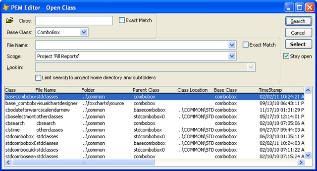

### IDE Tools: Add Object

This tool adds a new object to the currently selected object.

The dialog for selecting the object to add (see below) allows searching in a number of different ways:

*   By project or folder
*   By some of all of the class name
*   By the class’s base class

This was originally implemented in response to a user request to make it easier to add objects into columns.

