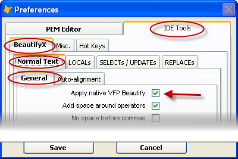
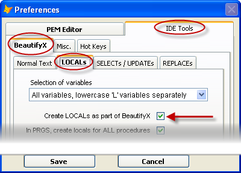
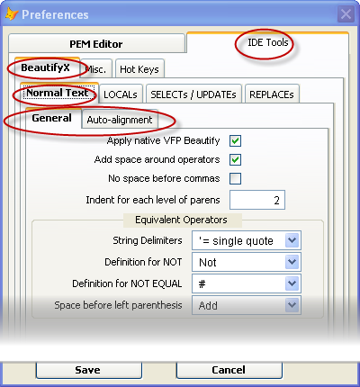
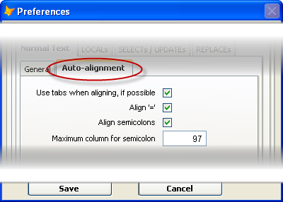
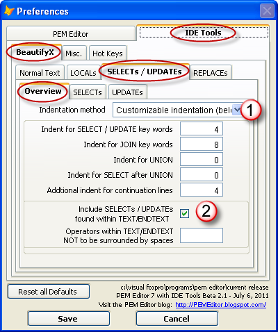
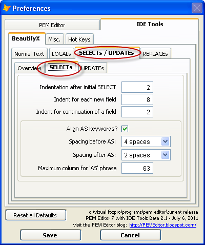
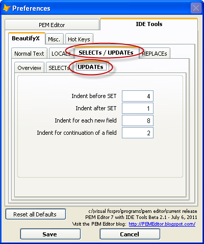

<div class="wikidoc">

### IDE Tools: BeautifyX

**BeautifyX** provides a wide range of customizable features for improving the display and readability of code.  It is used when you are editing code, and is applied either to the highlighted text (if any) or to all of the code. The beautification does not apply to comments, character constants, or TEXT / ENDTEXT blocks (although exceptions to this are provided).

There are four different areas covered by **BeautifyX**.

1.  Native FoxPro Beautify (fixing one bug along the way)
2.  Creating Locals (see <u>Creating Locals)</u>
3.  Styling for normal code
4.  Styling for SQL statements (Select, Update, and Delete) and Replace

All of these features are controlled by the menu item “Edit Preferences for  IDE Tools”, found under the ‘IDE Tools’ pull-down menu in the FoxPro system menu.

**Applying Native FoxPro Beautify:**  
If selected, BeautifyX will first apply native FoxPro Beautify.  

There is a bug in native beatify having to do with the handling of mixed case keywords in continuation lines. This bug is corrected by BeautifyX.  




**Creating Locals:**  
BeautifyX can also incorporate another tool, [Create Locals](pemeditor_tools_create_locals.md), so that it is run at the same time as the rest of BeautifyX.



  
**Styling for normal code:**

There are a number of options that control styling of normal code:

*   Insuring that there is at last one space on either side of operators (+, –, /, *, =, #, $, %, >, <, !)
*   Removing spaces before commas
*   Indentation to be added on continuation lines for each level of parentheses
*   Preferred operators when FoxPro has equivalent operators:
    *   single quote, double quote, or brackes
    *   NOT or !
    *   #, !=, or <>
*   Handling for spaces before left parentheses (add, remove, or leave unchanged.)

*   Alignment across multiple lines:
    *   For = signs (assignments on consecutive lines)
    *   for semi-colons marking continuation lines, with a value for the maximum column.  Note that if the maximum column is necessary here, otherwise all the semi-colons are driven as far to the left as possible.  





**Styling for SQL statements (Select, Update, and Delete) takes statements that look like this:**

```foxpro
Select Detail.*;
 	, Cast (Nvl (Dimensions.MCUnits, 1) As N(10)) As MCUnits;
 	, Cast (Evl (PartsList.CaseCount, 10) As N(10)) As CaseCount;
 	, Cast (0 As N(10)) As CasesOrd;
 	, Cast (0 As N(10)) As CasesShip;
 	From ShippedDetails As Detail;
 	Left Join Dimensions;
 	On Detail.Partno = Dimensions.Partno;
 	Join PartsList;
 	On Detail.Partno = PartsList.Partno;
 	Where Ordnbr = Thisform.cOrdNbr;
 	Into Cursor crsr_Source Readwrite</pre>
```
 
**and applies standardized, customizable styling to make them look something like this:**  
 
```foxpro
Select  Detail.*                                                        ;
      , Cast (Nvl (Dimensions.MCUnits, 1) As N(10))      As  MCUnits    ;
      , Cast (Evl (PartsList.CaseCount, 10) As N(10))    As  CaseCount  ;
      , Cast (0 As N(10))                                As  CasesOrd   ;
      , Cast (0 As N(10))                                As  CasesShip  ;
    From ShippedDetails                                  As  Detail     ;
        Left Join Dimensions                                            ;
            On Detail.Partno = Dimensions.Partno                        ;
        Join PartsList                                                  ;
            On Detail.Partno = PartsList.Partno                         ;
    Where Ordnbr = Thisform.cOrdNbr                                     ;
     Into Cursor crsr_Source Readwrite
```

All of the styling applied to SQL-Select, Update, and Delete statements, as well as Replace statements are controlled on the preferences form (see screenshots below):

Two important things to take note of:

1.  For any of these options to take effect, you must select PEM Editor’s customizable indentation.
2.  While Native FoxPro Beautify does not change lines in TEXT / ENDTEXT blocks, BeautifyX <u>can</u> apply this custom formatting of SELECT and UPDATE statements to such lines. There are two different mechanisms for doing so:
    *   There is a Preference item to apply SELECT and UPDATE to <u>all</u> TEXT / ENDTEXT blocks, as long as the first word is SELECT or UPDATE. This can be over-ridden for individual TEXT/ENDTEXT blocks by adding the directive {PEME:Ignore} (case insensitive) to the comments at the end of the TEXT line:

```foxpro
TEXT TO lcSQL TEXTMERGE NOSHOW    && {PEME:Ignore}
```
*   Or, individual TEXT/ENDTEXT blocks can be formatted by adding the directive '{PEME:Select}' (case insensitive) to the comments at the end of the TEXT line:

```foxpro
TEXT TO lcSQL TEXTMERGE NOSHOW    && {PEME:Select}
```





