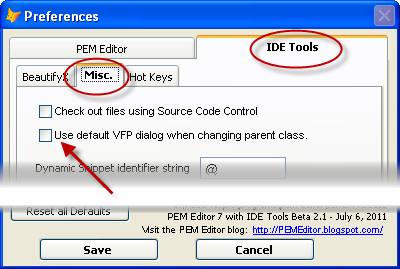

### IDE Tools: Re-Define Parent Class

This feature allows you to re-define the parent class of an object.

You are first prompted for the new parent class for the object (see note at the bottom). There will be an additional warning prompt if you attempt to change the baseclass of the object.

You are then presented with a form like this, where you complete the process of changing the parent class:

This form shows you which properties or methods cannot be copied because they do not exist in the parent class (greyed out), allows you to select which of the remainder you wish to have copied (normally all - but not always), and is a last-minute check before actually changing the parent class.

Note that changing the parent class does not work for either:

1.  Container objects (containers, grids, etc.) which have any child objects.
2.  Objects which are members of a parent class (and thus cannot be deleted).

The default form used to find the new parent class is the ‘Open Class’ form from IDE Tools.  This can be modified to use the default VFP ‘Modify Class’ dialog by using the Preferences form.

