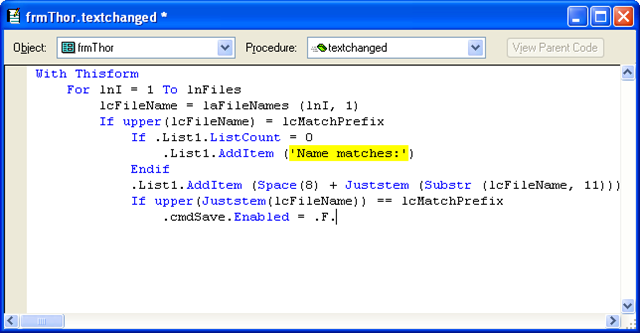
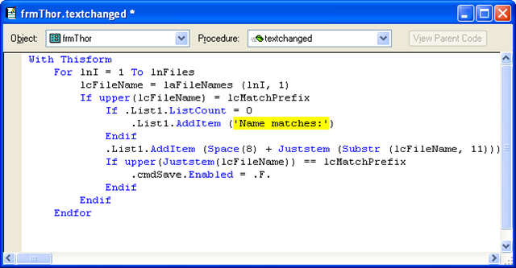
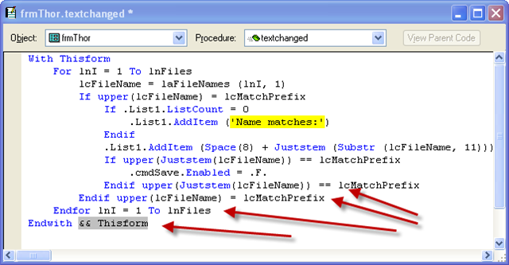

### IDE Tools: Close Control Structure

This tool performs the simplest of tasks: it supplies the correct closing statement for a control structure. 

Follow the sequence as this tool is used repeatedly on this code sample, each time adding the another closing statement. (And, don’t miss the comments at the end.)

**Customization**: There is a plug-In PRG that allows you to modify the behavior of this tool.  It allows you to modify the text of the closing statement (such as including the text from a beginning IF statement).  See [Plug-Ins](pemeditor_tools_plug-in_prgs.md).

For example, see how this code ***could*** have looked if it used a Plug-In which includes the text from the beginning of each control structure:

**Control Structures:**

*   If / Endif
*   Do Case / EndCase
*   Do While / EndWhile
*   For / EndFor
*   Try / EndTry
*   With / EndWith
*   Text / EndText
*   Procedure / EndProc
*   Function / EndFunc
*   Define Class / EndDefine

**See also: [Highlight Control Structure](pemeditor_tools_highlight_control_structure.md)**
