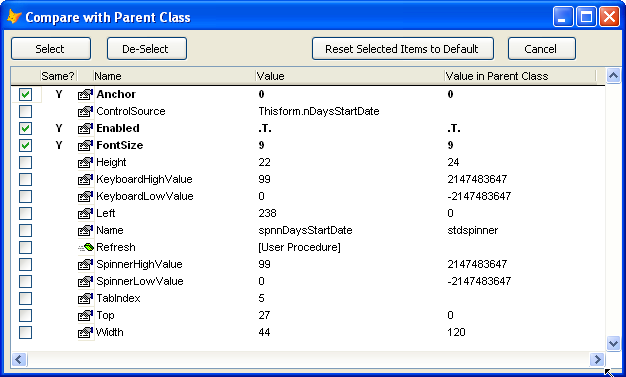

### IDE Tools: Compare with Parent Class

This tool displays a new form which shows all non-default properties and methods for an object, along with their current values and the values that would have been inherited from the parent class.  PEMS that are identical to their inherited values are highlighted and may be reset to default.

Note that if the object is actually a member of a parent class, it actually digs into the parent class that the object is a member of, and extracts all non-default properties and methods from there as well. 

All values which are identical to the parent class are initially checked off (and bold).  The list of selected items can be modified as needed.  Then, if desired, the button 'Reset Selected Items to Default' can be used.

This feature is also used as the final step when copying properties and method code from an object into its parent class during re-factoring.  See also [Paste properties and Method Code](pemeditor_tools_paste_properties.md)
