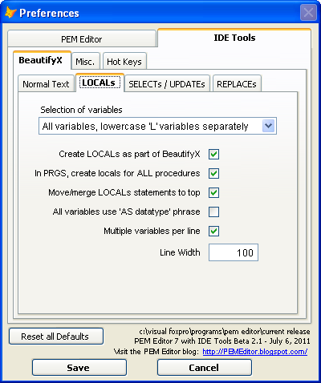

### IDE Tools: Create LOCALs

**Create Locals** provides for the creation of LOCALs statements for variables which are assigned values in a method or procedure.

Once the list of variables assigned in the method or procedure is harvested, the LOCALs statements are created.  They appear at the top of the method or procedure, before any existing code, with the variables in alphabetical order.

There are a number of user preferences available (see the preferences form, below):

*   Controlling which variables are added to the LOCALs statements, one of:
    *   Lowercase 'L' variables only
    *   Lowercase 'L' variables only, with a commented list of others not beginning with lowercase 'L'
    *   All variables, with lowercase 'L' variables listed separately
    *   All variables, merged
*   For PRGs, controlling whether the tool applies to the entire PRG or just for the one where the cursor is
*   Controlling the format of the LOCALs statements:
    *   All other LOCALs statements can be merged into the newly created statements.
    *   The implicit datatype for each variable ('lnCounter as Numeric") can be displayed.
        *   The 'AS' clauses can be aligned.
    *   You can control how many variables are displayed per line:
        *   If you do not check 'Multiple variables per line', you will get one LOCAL statement with many continuation lines, one variable per line. 
    
```foxpro
    Local lnDay, ;
        lnI, ;
        lnPeriod
```
*   If you do not check 'Multiple variables per line' and check 'LOCAL single on line', 
you will get one LOCAL statement with many continuation lines, one variable per line. The term 'LOCAL'  as ther only tem on first line

```foxpro
    Local;
        lnDay,;
        lnI,;
        lnPeriod
```

*   If you do check 'Multiple variables per line', you will get multiple LOCAL statements, each with as many variables as will fit within the line width that you supply. Note that if you supply a very small line width, you will actually get one LOCAL statement for each variable.

```foxpro
    Local lnDay, lnI, lnPeriod
```

*   If, or if not a space is inserted befor semicolon, is controled by BeautifyX option 'Add space before commas'.

**Customization:** There is a plug-In PRG that allows you to modify the behavior of this tool to fit your own needs.  (See [Plug-Ins](pemeditor_tools_plug-in_prgs.md).)

The plug-in is called with an array of all the harvested variable names, and returns a character string result which will pasted into the method code.  Thus, the plug-in can determine which variables will be placed in the LOCALs list and how they are displayed. There is also enough information to identify ‘orphan’ locals – that is, variables that appear in the LOCALs list but are not assigned a value anywhere.


