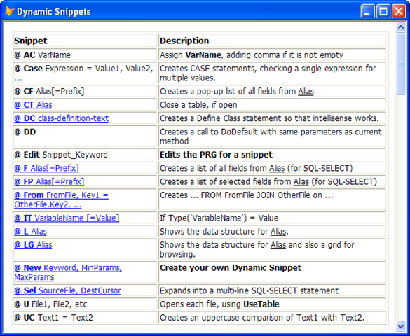

### IDE Tools: Dynamic Snippets

Using Intellisense autocompletion, keywords entered into method code or in the command window can be expanded to create commonly used blocks of code:  ‘MC’, for instance, becomes ‘Modify Command’, and ‘DOCASE’ expands to create a mutli-line DO CASE / ENDCASE block.  This capability is familiar, very useful – but only creates static blocks of code.

**Dynamic Snippets** take this one step further: one or more keywords can be passed to a PRG to be processed so that the text that is then pasted in can be determined by the parameters.

Before the details, some examples:

> **CT Customers**   _… expands to …   _ **Use in (Select ("Customers"))**
> 
> **IT _oPEMEditor = O**   _… expands to ..._   **If Type (‘_oPEMEditor’) = ‘O’**
> 
> **UC lcName1 = lcName2**   _… expands to ..._   **Upper(lcName1) = Upper(lcName2)**
> 
> **CASE lcType = ‘Property’, ‘Event’, ‘Method’** _… expands to ...  _
> 
> > **Do Case**
> > 
> > **    Case lcType = ‘Property’**
> > 
> > **    Case lcType = ‘Event’**
> > 
> > **    Case lcType = ‘Method’**
> > 
> > **    Otherwise**
> > 
> > **EndCase**
> 
> **FP Alias** _… opens a form listing all fields in {Alias}, allows selection of fields, and pastes in the selected field names._

**CT** (‘Close Table’), **IT** (‘If Type’), **UC** (‘Upper Case’), **CASE**, and **FP** (‘Field Picker’) are examples all Dynamic Snippet keywords. 

### How do Dynamic Snippets work?

Each Dynamic Snippet is defined by the existence of a PRG, having a particular structure for the name of the PRG, as well as for the parameters and result.  Generally, the PRG will be called with the parameters that were entered into the code window, and the result is the text that is to be pasted in. _(More details below)._

Dynamic Snippets are <u>invoked</u> either by using the assigned hot key (the recommended method) or selecting the Dynamic Snippet option from a menu (although this is a little cumbersome).

All text to the left of the cursor will be evaluated and passed to the appropriate PRG (with an exception, see below).  The first ‘word’ must be the Dynamic Snippet keyword, followed by white space, and then the parameters which are to be passed, as text, to the PRG. _(More details below)._

*   <u>Exception:</u> As defined above, Dynamic Snippets could only be defined at the beginning of a line. They can, in fact, be entered elsewhere in a line.  To indicate where the Dynamic Snippet keyword is to be found, use the Dynamic Keyword “identifier string”, which has a default value of [‘@’](mailto:‘@’) (modifiable in the Preferences form). Thus, to use the **FP** Dynamic Snippet from the last example above, you would enter a line that looks like: **Select @FP Alias.**

### How do I learn what Dynamic Snippets are available?

There is an internal Dynamic Snippet ‘?’, which brings up a form of all currently defined Dynamic Snippets.  Thus, from the command window, enter ‘?’ and using the Dynamic Snippet hot key will bring up a form that looks like this:

This list, of all the Dynamic Snippets, shows not only the keywords, but also their parameters and descriptions – and, if provided, a longer description as well (bookmarks at the left).

There are a number of pre-defined Dynamic Snippets.  The actual code for them exists in the PEM Editor folder ‘**Dynamic** **Snippets\Snippet Samples**’.  If desired, you can modify any of them and then activate your change by copying the PRG into the parent foler (‘**Dynamic Snippets’**).

### How do I create a new Dynamic Snippet?

There is an internal Dynamic Snippet ‘New’, which brings up a form to initiate the creation of a new Dynamic Snippets.  Thus, from the command window, entering ‘New’ and using the Dynamic Snippet hot key will bring up a form that looks like this:

This form allows you to indicate the Snippet Keyword (no spaces or special characters, since it will be used as part of the PRG name), what the delimiter character between parameters is to be, and finally provides instructions with how to proceed once you click “Save and Edit” (which creates the PRG and opens it for you to edit).

The PRG will be created in the ‘**Dynamic Snippets’** folder.  You can move it, if you wish, to any folder in your path.

The PRG created will follow a very definite structure.  You will put your code in the function \<Process>.  You will also want to modify function \<PublishHelp> as well, since the information you enter there determines what is displayed when you review the list of all Dynamic Snippets (see above).

### How can I edit Dynamic Snippets?

There is an internal Dynamic Snippet ‘Edit’ which takes a single parameter which is the snippet keyword you want to edit.

It is recommended that you actually use this on some of the pre-defined Dynamic Snippets to see how there are coded.

### How are the PRGs named and where do they live?

Dynamic Snippet PRGs are named \<PEME_Snippet_Keyword.PRG>, where keyword matches the keyword for the snippet.

The PRGs can be stored anywhere in the path or in the ‘**Dynamic Snippets’** of PEM Editor.  Note that if there are snippets found with the same name in multiple folders, the first one encountered takes precedence. 

### How can I share Dynamic Snippets?

Dynamic Snippets can be submitted to this address: [VFPThorRepository@GMail.Com](mailto:VFPThorRepository@GMail.Com)