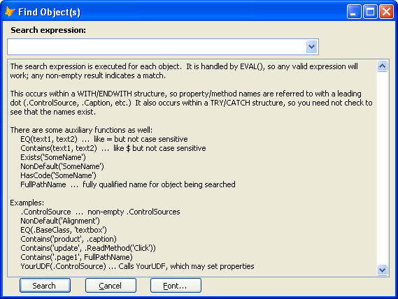
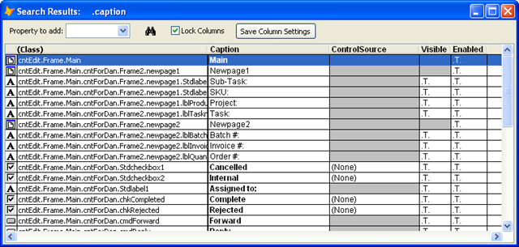

### IDE Tools: Find Objects

**Find Objects** provides the ability to search through all objects in a form or class based on values of their properties, to display the list of found objects in a grid for easy review, and then to modify the values of properties for those objects, either individually or all at one time.

**Step 1: Using the ‘Find Object(s)’ search form**

This form looks like this:

The search expression entered here will be executed for each object in the form or class.  If the expression returns a non-empty result, that object will be considered a match.

The search expression is executed within a With / EndWith structure for each object, so that properties can be referenced simply:  .ControlSource or .Caption, for instance.

The search expression is also executed within a Try / Catch structure, so that there is no need to be concerned about non-existent properties.

Many searches are quite simple then:  **_.ControlSource_** will find all objects with non-default controlsources.

The search expression can, however, be as complicated as desired, and can even call your own UDFs. (More on this in a bit.)

In addition, there are some auxiliary procedures and functions available:

Name|Explanation
---|---
EQ(text1, text2)|Like =, but not case sensitive
Contains(text1, text2)|Like $, but not case sensitive
Exists('SomeName')|Is “SomeName” a property, method, or event?
NonDefault('SomeName')|Does “SomeName” exist and is it non-default?
HasCode('SomeMethod”)|Does “SomeMethod” exist and does it have code, either here or inherited?
FullPathName|Fully qualified name for object being searched

Some examples of usage:

Search phrase|Result
---|---
.ControlSource|non-empty .ControlSources
EQ(.BaseClass, 'textbox')|for those of us who cannot remember case of baseclasses
Contains('product', .caption)|‘product’ appears anywhere in the caption
Contains('update', .ReadMethod('Click'))|‘update’ appears in the Click method
Contains('.page1', FullPathName)|All objects in ‘.page.’
YourUDF(.ControlSource) ...|Calls YourUDF, which may set properties

### Step 2: The Results Grid

The results grid has one line for each objects, and columns which show the name of the object and various other properties:

Any properties referenced in the search expression are automatically shown as columns in the grid.  You can also control the grid display in a number of other ways:

*   You can add properties from the combobox at the top left.
*   You can also add properties by using Ctrl-Click on a row in the grid in the PEM Editor form (see the next section).
*   You can remove properties by using the right-click combobox on the column,
*   You can move or resize the columns.
*   You can save the column settings so that the grid will be displayed with the same columns, etc, the next time.

You can change the value of any property by double-clicking on it, then using the popup property editor.  You can also reset values to default by using the right-click context menu. (See also the next section for changing all the values for a property at once.)

You can also select one of the objects to be displayed in the PEM Editor form by double-clicking on the object name in the first column.  When possible, this will also cause the object to be selected in the form or class being edited.

### Co-ordination with PEM Editor

If the PEM Editor form is open when a search is done, it will show the list of all properties and methods, just as if you had selected a number of objects on the form or class being edited using the mouse and /or keyboard.  This allows you to change the value of a property for all selected objects all at once, either by double-clicking on the property, or by resetting the property to default (in the right-click context menu).

You can also cause properties to be added to the Search Results form by Ctrl-Clicking on them in the PEM Editor form.

**Finally –** When you have selected a number of objects in the form or class you are editing, you can actually use the ‘Search Results’ form to edit the values for single properties individually.  Even if the ‘Search Results’ form is ***not*** open, ctrl-clicking on a property when you have selected multiple objects will open up the ‘Search Results’ form and add the property as a column there, where the values can be reviewed and edited.