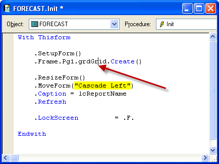
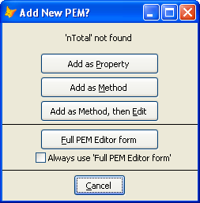

### IDE Tools: Go To Definition

**Go To Definition**, modeled after "View Definition" in Visual Studio, allows you to point to a name that is referenced in your code, and go to (that is, display and/or edit) its definition. It can be used to create new methods and properties in a form or class.

The mechanics are simple:

*   Click on the name.
*   Run **Go To Definition**.

The “name” that is searched for is determined as follows:

*   All characters to the right of the cursor (or of the selected text, if any) that can be part of a name (letters, numbers, and underscore) are included.
*   All characters to the left of the cursor (or of the selected text, if any) that can be part of a name, including periods, are included.
*   If the leftmost character is a period, and is only preceded by whitespace, then the preceding code is examined looking for WITH statements.  This is done repeatedly, handling embedded WITHs.

In the following example, the name being searched for is “Thisform.Frame.Pg1.grdGrid”.  (Note that the cursor does not have to be within the word; in this case it could have been after the period on the left or before the period on the right.)

The following table summarizes all the different types of names that can be searched for:

Type of Name:|Action taken:
---|---
A method|Opens up the method for editing, if there is any local non-default code; otherwise opens up a txt file containing all the inherited code for the method. *(see also note #1 below)*
An object|Selects that object, if possible, for display in PEM Editor and property window.  There are some conditions where this fails: If the object is hidden beyond other objects or not otherwise visible, and if it is on a different page of a pageframe (this list seems to fail intermittently). *(see also note #1 below)*
A property|Same as selecting an object, but also tries to select that property in the PEM Editor grid.  This only works if the PEM Editor form is open, and may also fail based on the filters in effect in the grid. *(see also note #1 below)*
DODEFAULT|Opens up a txt file containing all the inherited code for the method. *(see also note #1 below)*
THIS|Same as ‘an object’, above. *(see also note #1 below)*
THISFORM|Same as ‘an object’, above. *(see also note #1 below)*
a PRG|Opens the PRG. *(see also note #2 below)*
a PROC or FUNC in a PRG|Opens the PRG and highlights the start of the PROC or FUNC  *(see also note #2 below)*
a Constant *#Define …)|Opens the #Include file, and highlights the constant *(see also note #2 below)*
a Form|Opens the form *(see also note #2 below)*
a Class|Opens the class, whether it is in a VCX or PRG *(see also note #2 below)*
CREATEOBJECT or NEWOBJECT|Opens the class, whether it is in a VCX or PRG *(see also note #2 below)*

### Notes:

1.  It is not always possible to resolve what ‘THIS’ refers to when looking at method code.  It is possible to learn the name of the object that owns the code, but not what the full path name of the object is.  Thus, it is possible, if there are objects having the same name, that the search will find the wrong object.  This is alleviated somewhat if the method code was opened by PEM Editor of Document TreeView, as they change the title of the window to display the full name of the object.
2.  If the search is to be conducted looking in file(s) other than the form or class being edited, the files in the active project, if any are searched; if there is no active project, then all files in the path are searched.

### If nothing found, there is still this:

If the name being searched for looks like it could be a new Property or Method, then the following form will pop up allowing you to create it on the fly (adding it to _MemberData as appropriate, assigning the mixed case name for the new PEM).

### And, finally, this:

**Customization:** If there is still nothing found, there is this: There is a plug-In PRG that allows you to perform you own search for the name. (For example, the name could be an alias for a table; the table could be opened for browsing.)  See [Plug-Ins](pemeditor_tools_plug-in_prgs.md).
