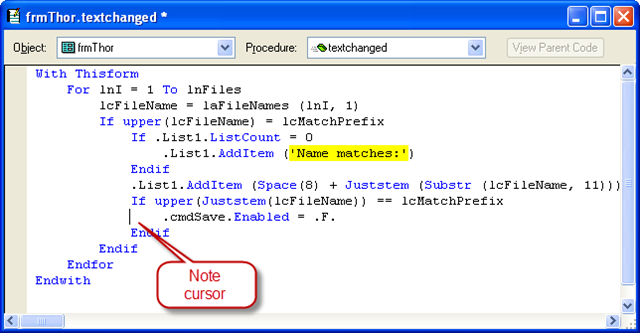
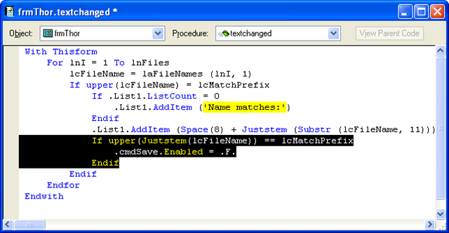
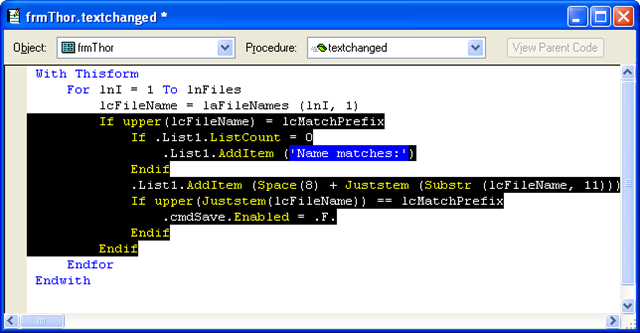

### IDE Tools: Highlight Control Structure

This tool highlights the current control structure where the cursor is.  The cursor may be on the first or last line of the control structure, or any line within it.

This tool is closely related to another tool, [Close Control Structure](pemeditor_tools_close_control_structure.md).

**Thus, before:**

**And after:**

**Repeated uses result in ever wider control structures being highlighted:**

**Control Structures:**

*   If / Endif
*   Do Case / EndCase
*   Do While / EndWhile
*   For / EndFor
*   Try / EndTry
*   With / EndWith
*   Text / EndText
*   Procedure / EndProc
*   Function / EndFunc
*   Define Class / EndDefine