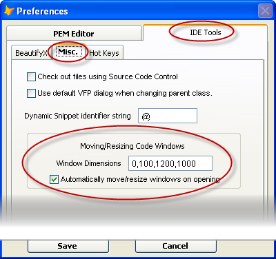

### IDE Tools: Move/Resize Window

This tool allows you to move and/or resize the currently open editor window.

The dimensions to be used for the new window need to be defined in the Preferences form.

They are entered, in pixels, in the following order: Left, Top, Width, and Height.

Notes:

*   You may skip any dimensions that you want to ignore.
*   The window will not be resized so that it is too wide or too tall; thus, you can set the Width and Height values to be very large (say, 5000) and the window will expand to the maximum that will fit.
*   The check box about automatically doing this on opening windows applies to all windows opened by PEM Editor, Document TreeView, or and of the IDE Tools that come with PEM Editor.

