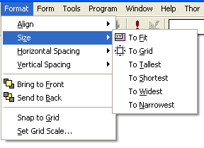
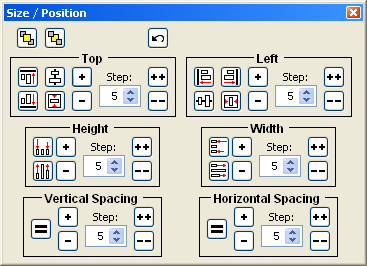
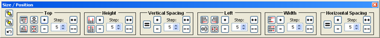
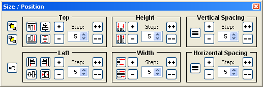

### IDE Tools: Object Size and Position

The ‘Object Size and Position’ form combines almost all of the features of the native VFP Format Menu (on the left) into one form (on the right).

This was done so that all the features from the Format Menu could be available with one click, and to simplify access to those which may be used multiple times consecutively (such as when increasing a dimension by a pixel).

VFP Native Format Menu

Object Size and Position Form

Notes:

*   Not ***all*** of the features of the Format menu have been duplicated here.  The following are missing:
    *   Size to fit
    *   Size to grid
    *   Snap to grid
    *   Set grid scale
*   There are some new features.  For each of the dimensions and spacings, you can increment or decrement either by a single pixel at a time or you can select a larger step size.
*   There is also an UnDo button, which will reverse any actions taken since the form took focus.
*   The containers within the form get moved around as the width of the form changes.  This is provided so that the form can be docked either vertically or horizontally.  Below are the displays for each of the other configurations:

  

   

   