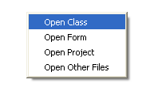
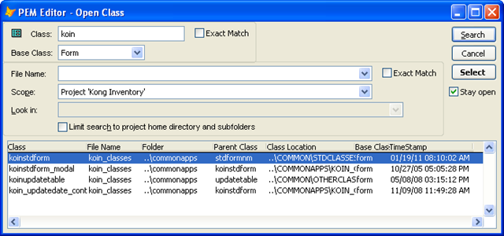

### IDE Tools: Open Files

This tools creates a pop-up menu to select one of four dialogs for opening files:  

The dialogs are very similar, allowing searching by some or part of the file name, as well as within the current project or the current folder.

In all of the dialogs, you may move or resize the columns, as well as clicking on the column header to sort.

The dialog for opening a class has three additional features:

1.  You can search on some or all of the class name (partial match to ‘KOIN’ here).
2.  You can search by the base class you are looking for.
3.  You can select a row from the grid and then drag the icon in the upper left corner to drop it
    *   onto a form or class OR
    *   onto the PEM Editor form, which will cause it to be added to whatever object is currently displayed in the PEM Editor grid.  Normally not necessary, this is quite handy for those times when dragging and dropping is cumbersome, such as when adding controls to a grid column or to a container that is obscured by other objects.

**See also: [Managing MRU lists and Source Code Control](pemeditor_tools_mru_notes.md)**
