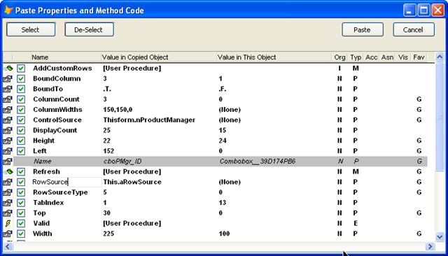

### IDE Tools: Paste object

This feature creates a new object, using the class name and library captured by "Copy Object" and then pastes the properties and method code that has been copied into that object.

The new object will be a child of the currently viewed object, if that object can have children; otherwise, it will be a sibling of the currently viewed object.

This form shows you  allows you to select which of the PEMs from the source object you wish to paste into the new object.

Paste Object works essentially the same as VFP's familiar Paste of an object, with the following enhancements:

*   You can copy any object, including those which VFP cannot (the familiar message "Cannot copy objects because some are members of a parent class")
*   You can copy an entire class when editing it. Then, when the class is closed, it can be paste into another form or class.
*   You can select which properties, methods, and events you wish to paste.

As mentioned elsewhere, the "clipboard" that the properties and method code gets pasted into survives even if you close PEM Editor; they will survive as long as 'Clear All' is not used, which removes the object containing them from memory.
